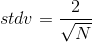
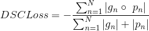
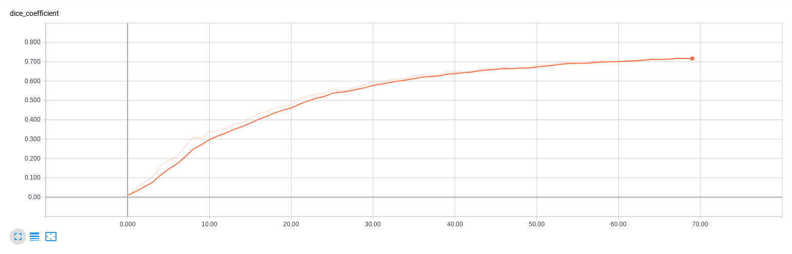
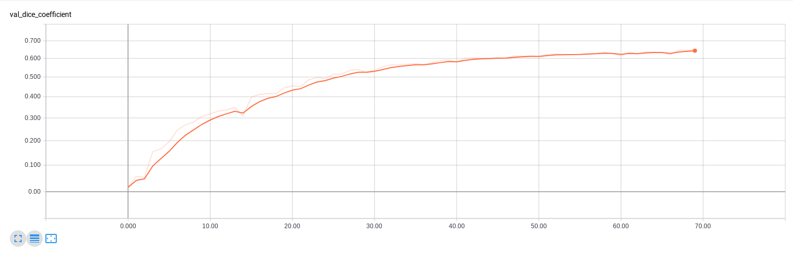

# WhiteMatterHyperintensities

**This repo is no longer mantained, may contain errors, work continuation will be uploaded in a different repo eventually.**

White matter hyperintensity segmentation using a 2D U-Net. Keras with Tensorflow backend.

Currently working on modifications and improvements


## Brain extraction:

Using BET-FSL


Axial view             |  Sagital view          | Coronal view 
:-------------------------:|:-------------------------:|:-------------------------:
  |  |  
  |  |  


## Normalization:

All slices where shaped to (240, 240)

###### Pixel intensity normalization:

$$
norm(x) = 
			\begin{cases}				
				0.0, & \ \ \ \ if \ \  x \leq P_{5} \\
				1.0, & \ \ \ \ if \ \  x \geq P_{95} \\				
				\frac{x - min}{max - min}, & \ \ \ \ otherwise
			\end{cases}
$$


## Data augmentation:

| Shifts                                       | Rotations   |
| -------------------------------------------- | ----------- |
| X axis: [-0.3, 0.3]<br />Y axis: [-0.3, 0.3] | [-15º, 15º] |


## T1, FLAIR and FLAIR's top-hat as a 3 channel image input for the network


## Training:


### Weight initialization

Based on a Gaussian kernel of:

  


### Loss function

Dice Similarity Coefficient Loss over N slices where $ N = batch\_size  $





### Optimizer: Adam (Keras implementation)

### Hyperparameters:

- Batch size: 30
- Learning rate: 0.000001


## Results

| Input image                        | Ground truth                    | Prediction                           |
| ---------------------------------- | ------------------------------- | ------------------------------------ |
|  |  |  |
|  |  |  |


#### Validation DSC = 0.6494






## Demo

I cannot provide the data myself, so please request access to it in the WMH challenge website. Once you have access to such data please have in mind the structure of the directories to get this project working.

```
WhiteMatterHyperintensities #repo folder
│   README.md
│   metrics.py
|   ...
│
GE3T
└─── 100
     └─── wmh.nii
     └─── pre
          └─── brain_FLAIR.nii
          └─── brain_T1.nii
└─── 101
└─── 102
└─── ...
Singapore
└─── 50
└─── 51
└─── 52
└─── ...
Utrecht
└─── 0
└─── 2
└─── 4
└─── ...
```

Where brain_T1.nii and brain_FLAIR.nii are the respective outputs of BET-FSL brain extraction for their respectives T1 and FLAIR images. So the parser obtains the images from "../GE3T", "../Singapore" and "../Utrecht".

Then you would have to make a couple changes in the twod_runner.py file:

```python
training_name = 'NAME_OF_EACH_TRAINING'
base_path = 'YOUR_PATH/WhiteMatterHyperintensities'
```


It will generate a set of folders with the logs and models for each training, assuming you change the name of the training before each training.

Finally you can just execute the runner:

```bash
python3 twod_runner.py
```


## References summary

- Olaf Ronneberg, Philipp Fischer and Thomas Brox, *U-Net: Convolutional Netowrks for Biomedical Image Segmentation*, University of Freiburg, Germany, 2015.
- Yongchao Xu, Thierry Géraud, Elodie Puybareau, Isabelle Bloch and Joseph Chazalon.
  *White Matter Hyperintensities Segmentation Using Fully Convolutional Network and Transfer Learning*, 2017.
- M. Rincón, E Díaz-Lopez, P. Selnes, K. Vegge, M. Altman, T. Fladby and A.Bjornerud.  *Improved Automatic Segmentation of White Matter Hyperintensities in MRI Based on Multilevel Lesion Features.*, UNED, Madrid, Spain. 2017.
- Hongwei Li, Gongfa Jiang, Ruixuan Wang, Jianguo Zhang, Zhaolei Wang, Wei-Shi Zheng1 and Bjoern Menze. *Fully Convolutional Network Ensembles for White Matter Hyperintensities Segmentation in MR Images*, 2018.
- Fausto Milletari, Nassir Navab, Seyed-Ahmad Ahmadi, *V-Net: Fully Convolutional Neural Networks for Volumetric Medical Image Segmentation*, 2016.
- S.M. Smith, M. Jenkinson, M.W. Woolrich, C.F. Beckmann, T.E.J. Behrens, H. Johansen-Berg, P.R. Bannister, M. De Luca, I. Drobnjak, D.E. Flitney, R. Niazy, J. Saunders, J. Vickers, Y. Zhang, N. De Stefano, J.M. Brady, and P.M. Matthews. *Advances in functional and structural MR image analysis and implementation as FSL*. NeuroImage, 23(S1):208-19, 2004
